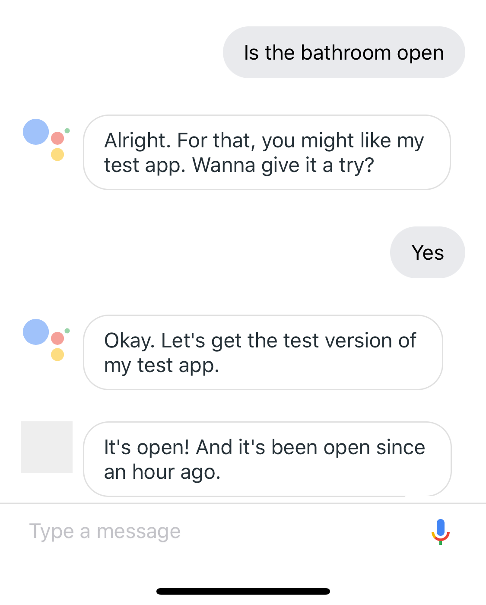

# Bathroom Status
Do you want to know if you're bathroom is open, but you don't want to open your eyes, get out of your seat or do anything more than just use your voice?

Introducing: Bathroom Status, the bleeding edge google home app that will tell you if your bathroom is open and ready for use. (Raspberry Pi server and code for bathroom door sold separately, also accessible through google assistant on mobile phones)

## Pictures:


## Tutorial for installing your own version
TBD


Example of a bathroom status JSON:
```JSON
{
  "is_bathroom_door_closed": false,
  "last_time_door_was_closed": "2018-04-17 04:43:14 EST",
  "last_time_door_was_open": "2018-04-17 04:54:08 EST",
  "secs_since_last_closed": 15278.79075,
  "secs_since_last_opened": 0
}
```


## Credits:
Reference taken from https://github.com/eisenzopf/google-action-three-doors
